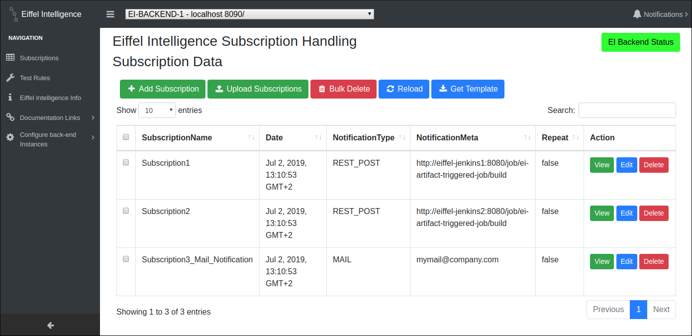

# GUI Overview

Eiffel Intelligence front-end GUI can be divided into two parts: a navigation
window and a work window.

<kbd>
    </img>
</kbd>

As the name suggests, the navigation bar provides its users one click access to
the resources to interact with EI. This window contains some buttons. Clicking
on any of these buttons result in either opening an interactive form in the
work window or opening a new window with some information resource.

A detailed description of the interactive elements present in the navigation
window and corresponding interactions in the work window is described in the
following pages.
