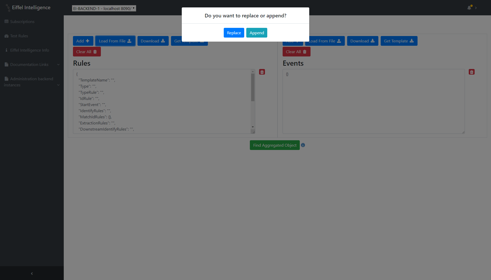
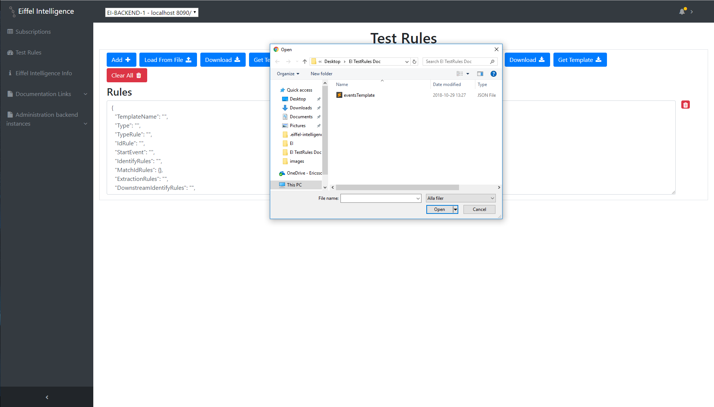
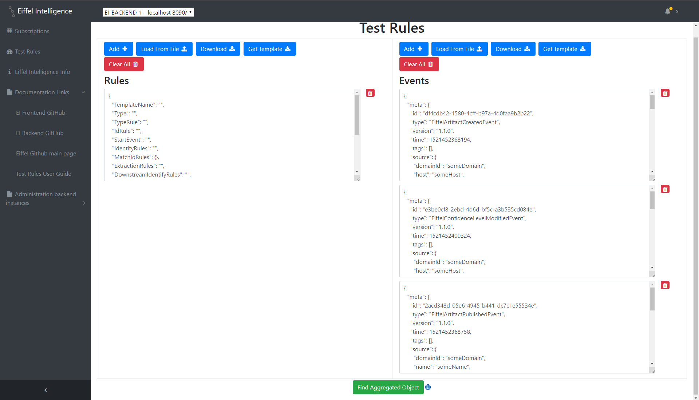
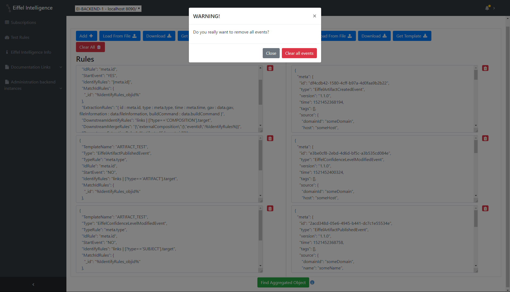
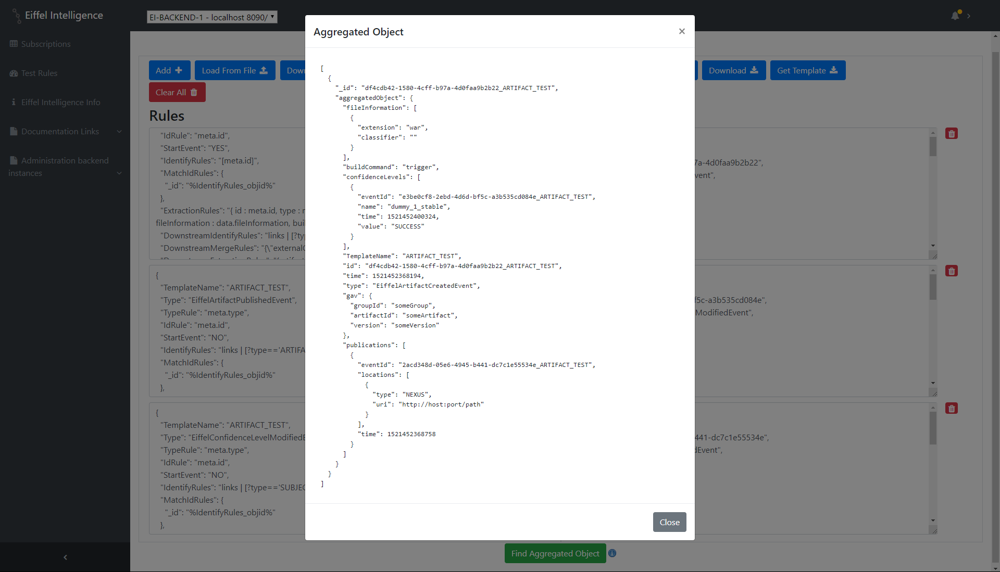

# Test Rules User Guide

Clicking on the Test Rules element in the navigator window opens an interface in the work window and interacts with the /rules/rule-check end point of Eiffel Intelligence. This interface can be used to test rules on events.

<h2>“Test Rules” Graphical User Interface</h2>

The graphical user interface for testing rules consists of two panes. Left pane is intended to add the rules and right pane is intended for adding the Eiffel events.

<h3>Add</h3>

Add buttons are for adding new rules/events. When you click on one of them, a new text area will show up. Then you can write or paste rule/event into it. There can be only one JSON object per text area. This means that it is not allowed to have more than one rule/event per text area.

<h3>Load From File</h3>

Load buttons are for loading rules/events from external files. The file content should be formatted as JSON objects in a JSON list, ex. [{Object1}, {Object2}]. After clicking on the button, it is possible to choose between replacing and appending to already written rules/events. A pop-up window with those two options shows up.

After that, you need to choose from which file you want to load rules/events.

When the file has been chosen, rules or events are loaded into text areas. In this example events template was loaded and the result can be seen on the image below.

<h3>Download</h3>

Download buttons are for downloading edited rules/events. This enables to edit rules/events locally and then upload them using above mentioned “Load From File” buttons.

<h3>Get Template</h3>

By clicking on "Get Template" buttons you will download rules respective events template. Rule´s template contains 3 rules and event´s template contains 3 events.

Rules Template

    [
      {
        "TemplateName": "ARTIFACT_TEST",
        "Type": "EiffelArtifactCreatedEvent",
        "TypeRule": "meta.type",
        "IdRule": "meta.id",
        "StartEvent": "YES",
        "IdentifyRules": "[meta.id]",
        "MatchIdRules": {
          "_id": "%IdentifyRules_objid%"
        },
        "ExtractionRules": "{ id : meta.id, type : meta.type, time : meta.time, gav : data.gav, fileInformation : data.fileInformation, buildCommand : data.buildCommand }",
        "DownstreamIdentifyRules": "links | [?type=='COMPOSITION'].target",
        "DownstreamMergeRules": "{\"externalComposition\":{\"eventId\":%IdentifyRules%}}",
        "DownstreamExtractionRules": "{artifacts: [{id : meta.id}]}",
        "ArrayMergeOptions": "",
        "HistoryIdentifyRules": "links | [?type=='COMPOSITION'].target",
        "HistoryExtractionRules": "{internalComposition:{artifacts: [{id : meta.id}]}}",
        "HistoryPathRules": "{artifacts: {id: meta.id}}",
        "ProcessRules": null,
        "ProcessFunction": null
      },
      {
        "TemplateName": "ARTIFACT_TEST",
        "Type": "EiffelArtifactPublishedEvent",
        "TypeRule": "meta.type",
        "IdRule": "meta.id",
        "StartEvent": "NO",
        "IdentifyRules": "links | [?type=='ARTIFACT'].target",
        "MatchIdRules": {
          "_id": "%IdentifyRules_objid%"
        },
        "ExtractionRules": "{ publications :[ { eventId : meta.id, time : meta.time, locations : data.locations  }] }",
        "ArrayMergeOptions": "",
        "HistoryIdentifyRules": "",
        "HistoryExtractionRules": "",
        "ProcessRules": null,
        "ProcessFunction": null
      },
      {
        "TemplateName": "ARTIFACT_TEST",
        "Type": "EiffelConfidenceLevelModifiedEvent",
        "TypeRule": "meta.type",
        "IdRule": "meta.id",
        "StartEvent": "NO",
        "IdentifyRules": "links | [?type=='SUBJECT'].target",
        "MatchIdRules": {
          "_id": "%IdentifyRules_objid%"
        },
        "ExtractionRules": "{confidenceLevels :[{ eventId:meta.id, time:meta.time, name:data.name, value:data.value}]}",
        "ArrayMergeOptions": "",
        "HistoryIdentifyRules": "",
        "HistoryExtractionRules": "",
        "ProcessRules": null,
        "ProcessFunction": null
      }
    ]

Events Template

    [
      {
        "meta": {
          "id": "df4cdb42-1580-4cff-b97a-4d0faa9b2b22",
          "type": "EiffelArtifactCreatedEvent",
          "version": "1.1.0",
          "time": 1521452368194,
          "tags": [],
          "source": {
            "domainId": "someDomain",
            "host": "someHost",
            "name": "someName",
            "serializer": {
              "groupId": "com.github.Ericsson",
              "artifactId": "eiffel-remrem-semantics",
              "version": "0.0.10"
            },
            "uri": "http://host:port/path"
          },
          "security": {
            "sdm": {
              "authorIdentity": "test",
              "encryptedDigest": "sample"
            }
          }
        },
        "data": {
          "gav": {
            "groupId": "someGroup",
            "artifactId": "someArtifact",
            "version": "someVersion"
          },
          "fileInformation": [
            {
              "classifier": "",
              "extension": "war"
            }
          ],
          "buildCommand": "trigger",
          "requiresImplementation": "NONE",
          "dependsOn": [
            {
              "groupId": "",
              "artifactId": "",
              "version": ""
            }
          ],
          "implements": [],
          "name": "event",
          "customData": []
        },
        "links": [
          {
            "type": "CAUSE",
            "target": "f2752b34-e4d6-4d6e-8ea8-e5e17aa9e1b3"
          }
        ]
      },
      {
        "meta": {
          "id": "e3be0cf8-2ebd-4d6d-bf5c-a3b535cd084e",
          "type": "EiffelConfidenceLevelModifiedEvent",
          "version": "1.1.0",
          "time": 1521452400324,
          "tags": [],
          "source": {
            "domainId": "someDomain",
            "host": "someHost",
            "name": "someName",
            "serializer": {
              "groupId": "com.github.Ericsson",
              "artifactId": "eiffel-remrem-semantics",
              "version": "0.0.10"
            },
            "uri": "http://host:port/path"
          },
          "security": {
            "sdm": {
              "authorIdentity": "true",
              "encryptedDigest": "true"
            }
          }
        },
        "data": {
          "name": "dummy_1_stable",
          "value": "SUCCESS",
          "issuer": {
            "name": "",
            "email": "",
            "id": "",
            "group": ""
          },
          "customData": []
        },
        "links": [
          {
            "type": "SUBJECT",
            "target": "df4cdb42-1580-4cff-b97a-4d0faa9b2b22"
          }
        ]
      },
      {
        "meta": {
          "id": "2acd348d-05e6-4945-b441-dc7c1e55534e",
          "type": "EiffelArtifactPublishedEvent",
          "version": "1.1.0",
          "time": 1521452368758,
          "tags": [],
          "source": {
            "domainId": "someDomain",
            "name": "someName",
            "serializer": {
              "groupId": "com.github.Ericsson",
              "artifactId": "eiffel-remrem-semantics",
              "version": "0.0.10"
            }
          }
        },
        "data": {
          "locations": [
            {
              "type": "NEXUS",
              "uri": "http://host:port/path"
            }
          ],
          "customData": []
        },
        "links": [
          {
            "type": "ARTIFACT",
            "target": "df4cdb42-1580-4cff-b97a-4d0faa9b2b22"
          }
        ]
      }
    ]

<h3>Clear All Rules/Clear All Events</h3>

"Clear All" buttons remove all rules respective events. After clicking on button, a pop-up window shows up and asks for confirmation. After confirming all rules or events are removed.

<h3>Trash Can Button</h3>

It is possible to remove single rule/event by clicking on trash can button next to specific text area.

<h3>Find Aggregated Object</h3>

Clicking on "Find Aggregated Object" button will start the aggregation process. If rules and events are correct, a pop-up window with the aggregated object will show up on the screen.

<h2>Curl</h2>

It is possible to use curl to get required information. To get information about test rules status, if this functionality is enabled in back end or not, you can execute command below.

    curl -X GET http://<host>:8080/rules/rule-check/testRulePageEnabled?backendurl="http://127.0.0.1:8090/"

To execute rules on specific events with curl, you need to create a JSON file with rules and events. File should contain:

    {
        "listEventsJson": [
            {Event1},
            {Event2}
            ...
        ],
        "listRulesJson": [
            {Rule1},
            {Rule2},
            ...
        ]
    }

And then run curl command below.

    curl -X POST -d "@<path to file>" -H "Content-Type: application/json" http://<host>:8080/rules/rule-check/aggregation?backendurl="http://127.0.0.1:8090/"

---
**_More information about how to write rules can be found [here](https://github.com/eiffel-community/eiffel-intelligence/blob/master/wiki/markdown/Rules.md)._**
